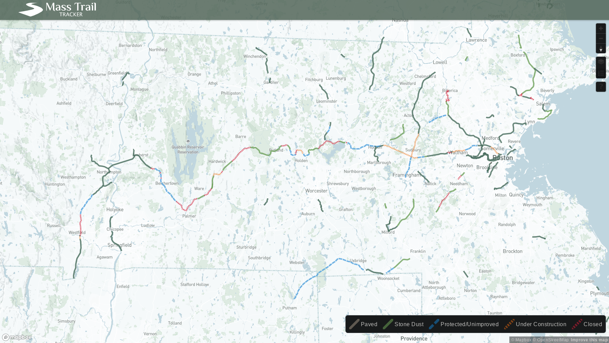

# mass-trail-tracker

# 🚀 Mapbox map of bike/ped and rail trails in Massachusetts 🚀

https://masstrailtracker.com/

https://github.com/coding-to-music/mass-trail-tracker

https://mass-trail-tracker.vercel.app/

From / By Danny Noenickx https://github.com/dnoenickx/mass-trail-tracker

He is mentioned here:

https://mass.streetsblog.org/2023/05/22/wu-admin-announces-safety-surge-of-traffic-calming-for-neighborhood-streets/

https://masstrailtracker.com/

Data comes from a private google spreadsheet, see `./backend/compile.py`

Perhaps other data is from `segments.geojson`

## Environment variables:

```java

```

## user interfaces:

https://masstrailtracker.com/

https://mass-trail-tracker.vercel.app/ (partial visualization)

## GitHub

```java
git init
git add .
git remote remove origin
git commit -m "first commit"
git branch -M main
git remote add origin git@github.com:coding-to-music/mass-trail-tracker.git
git push -u origin main
```

## Image of the map via https://masstrailtracker.com


